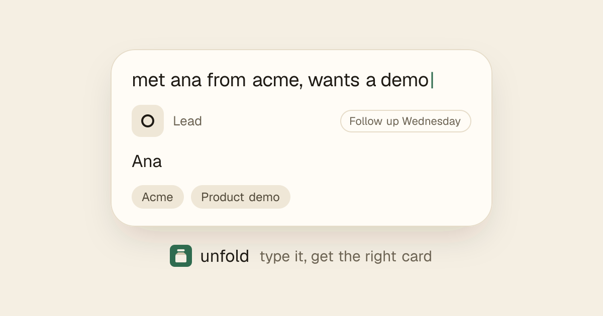

# unfold

**One text box for a marketer's day.** Type a quick, messy note and it unfolds into the right card as you type: a tagged campaign link, a lead with a follow-up date, a content idea, a grade for your LinkedIn draft and more.

<p align="center">
  
  <br>
  <sub><a href="https://useunfold.vercel.app"><b>Try it live</b></a></sub>
</p>

```
linkedin campaign spring launch acme.com/launch    →  UTM link · utm_source=linkedin&utm_medium=social&utm_campaign=spring-launch
met Ana from Acme, interested in a product demo    →  Lead · Ana, Acme · follow up in 3 working days
linkedin ads 500 spent, 12k impressions, 340 clicks →  Campaign results · 2.8% click rate · €1.47 per click
subject: "Your monthly recap" vs "3 ideas that…"    →  A/B test · Jev picks the winner
```

**Jev decides, code computes.** Which card you mean, and judgment calls like "is this hook strong?", come from [TypeSafe AI](https://typesafe.ai)'s **Jev** model through the [Vercel AI Gateway](https://vercel.com/ai-gateway). Everything factual (dates, numbers, links, names) is plain deterministic code, so Jev can't invent a wrong link or date.

It works **fully offline by default** with a built-in keyword classifier, so you can run it without an account.

## Cards

Press <kbd>/</kbd> in the app to see them all.

### Marketing

| Card | Try |
| --- | --- |
| UTM link | `linkedin campaign spring launch acme.com/launch` |
| Content idea | `post about how we doubled our newsletter signups` |
| Lead | `met Ana from Acme, interested in a product demo` |
| Post draft | paste a LinkedIn draft, or a public LinkedIn post link |
| Campaign results | `linkedin ads 500 spent, 12k impressions, 340 clicks, 25 leads` |
| Event promo plan | `promote our spring webinar on nov 15` |
| A/B test | `subject: "Your monthly recap" vs "3 ideas that doubled our signups"` |

- **UTM link** builds a tagged URL (source, medium, campaign, optional `content …`), lowercase with hyphens. Common sources map to a medium: LinkedIn, X and Instagram to `social`, newsletter to `email`, Google Ads to `cpc`. One click copies it.
- **Content idea** shows the idea and Jev's pick of format (LinkedIn post, carousel, article, video). Clicking another format writes it into the text ("… as a carousel"), so the choice is saved with the card.
- **Lead** shows name, company, interest and a follow-up date three working days later, unless you type one ("follow up monday").
- **Post draft** runs a second Jev call that scores the hook, picks the audience and flags AI-sounding copy. Code counts characters and shows where LinkedIn cuts to "…see more". <kbd>Shift</kbd>+<kbd>Enter</kbd> adds a line.
- **Campaign results** works out click rate, cost per click, cost per lead, conversion and cost per 1,000 views from the numbers you type.
- **Event promo plan** lays out announce (4 weeks before), reminder (2 weeks), one week to go, last call (the day before) and recap (2 days after), each with a Google Calendar button.
- **A/B test** asks Jev which subject line, headline or call to action wins, and how strong each one is on its own.

### Utility

| Card | Try |
| --- | --- |
| Event | `call with the design team tuesday 3pm on meet` |
| Reminder | `remind me to send the newsletter friday urgent` |
| Checklist | `launch checklist: brief, visuals, landing page, emails` |
| Timer | `25 min focus` |
| Calculate | `18% of 3450` |
| Contact | `ana silva +1 555 010 0199 ana@acme.com` |
| Bookmark | `https://example.com/blog check later` |
| Time zone | `3pm london in new york`, `what time is it in tokyo` |

### Send to

- **Add to Google Calendar** on events, reminders, leads and promo steps: a prefilled link, no login.
- **Send to Google Sheets** on every card: each visitor connects their own sheet once (a small Apps Script, see [docs/google-sheets.md](docs/google-sheets.md)). The link is saved in their browser only.

Saved cards live in your browser until you delete them. Click one to edit it.

### Keyboard

| Key | Action |
| --- | --- |
| <kbd>Enter</kbd> | Save the card |
| <kbd>Shift</kbd>+<kbd>Enter</kbd> | New line |
| <kbd>Esc</kbd> | Clear (or cancel an edit) |
| <kbd>Tab</kbd> | Keep a faint preview |
| <kbd>←</kbd> <kbd>→</kbd> | Choose between "Did you mean" chips |
| <kbd>/</kbd> | Open every card type |

URL flags: `?debug=1` shows every probability; `?demo=1&loop=1` plays a scripted demo.

## Run it yourself

Requires [Bun](https://bun.sh) 1.2+.

```bash
bun install
bun dev
```

Open http://localhost:3000 and start typing.

### Use the online Jev model (optional)

```bash
cp .env.example .env.local
# then set AI_GATEWAY_API_KEY=... (Vercel dashboard → AI Gateway → API keys)
```

Restart `bun dev`. The readout in the bottom-right corner switches from `jev-offline` to `typesafe-ai/jev`. The key is only read on the server and never reaches the browser. On Vercel, the project's OIDC token also works. If the gateway is unreachable, slow or rate-limited, unfold quietly falls back to offline mode.

| Variable | Default | What it does |
| --- | --- | --- |
| `AI_GATEWAY_API_KEY` | _(empty)_ | Turns on Jev via the Vercel AI Gateway. Empty keeps you offline. |
| `JEV_MODEL` | `typesafe-ai/jev` | Model id on the AI Gateway. |
| `NEXT_PUBLIC_USE_MOCK` | `false` | `true` forces offline even with a key. |
| `NEXT_PUBLIC_SITE_URL` | `http://localhost:3000` | Used for link previews. |

## How it works

On every pause while you type, one Jev call answers 8 typed questions in parallel: which card is this, is it urgent, which content format fits, and so on. A deterministic parser reads the same text for the details.

Raw model output flickers as you type, so a small state machine turns confidence into calm UI states. A card only changes when a challenger wins twice in a row (or is very sure), and signal badges use an on/off hysteresis band.

<p align="center"></p>

| Path | What lives there |
| --- | --- |
| `src/components/intents/registry.ts` | **The extension point.** One entry per card type. |
| `src/lib/jev/questions.ts` | The Jev question schema |
| `src/lib/jev/grade.ts` | Second Jev call for post drafts and A/B tests |
| `src/lib/jev/mock.ts` | Offline keyword classifier (same output shape) |
| `src/lib/parse/` | One deterministic parser per card type |
| `src/lib/decide.ts`, `src/lib/signals.ts` | The calm-UI state machine |
| `src/components/shapeshift/` | Shell, chips, palette, saved list, "Send to" row |

### Adding a card type

1. Add the key to `INTENT_KEYS` in `src/lib/jev/types.ts`.
2. Add a non-overlapping criterion to `intent` in `src/lib/jev/questions.ts`.
3. Write a parser in `src/lib/parse/` and register it in `src/lib/parse/index.ts`.
4. Write a card component in `src/components/intents/` and add a registry entry.
5. Teach the offline classifier in `src/lib/jev/mock.ts`, and add tests.

TypeScript will point at anything you missed.

## Development

```bash
bun run check    # typecheck + lint + tests
bun test         # parser, decision, signal and classifier tests
bun run build
```

Stack: Next.js (App Router), React 19, TypeScript, Tailwind CSS v4, shadcn/ui, Motion, chrono-node, zod, Vercel AI SDK.

## Credits and license

unfold is a fork of [Shapeshift](https://github.com/anishfn/shapeshift) by [anishfn](https://github.com/anishfn): the one-box idea, the calm-UI state machine and the original cards are theirs. [MIT](LICENSE); the original copyright notice is kept in the LICENSE file.
